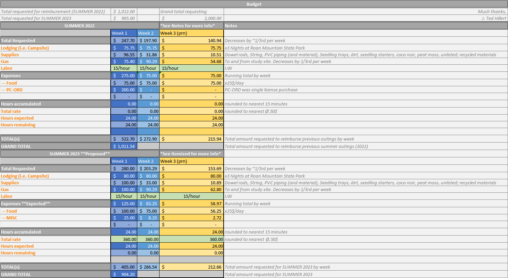

```{r setup, include=FALSE}

knitr::opts_chunk$set(echo=FALSE,
                      message=FALSE,
                      warning=FALSE)

library(papaja)

papaja::r_refs(file="proposal.bib")

options(knitr.kable.NA="")

```

# Disclaimer: This is a draft proposal. So long as the ducks lie, I plan to have a draft with preliminary analysis by March

# INTRODUCTION

### History

Upper montane treeless meadows - balds - host high floral diversity, panoramic views of the landscape, and origins shrouded in mystery [@murd1986; @gers1970; @hame1990]. Many speculate that balds were cleared by early settlers for pasturing livestock in the spring and summer seasons [@Lind1979] - anthropogenic origin. Others believe that they are of a "climate-herbivore" driven change in the landscape, making it a natural ecosystem [@weig1995; @weig2014]. There has been much in the way of "bald history" in the literature, but there is relatively little regarding vegetation dynamics following disturbance. Management of these balds varies by agency, type of bald - heath or grass, and proposed history - whether it was cleared, grazed, burned, or some combination of these [@weig2014; @weig1995; @lind1979b]. Separating bald origins and subtype vegetation dynamics is key to preserving these dwindling ecosystems and to conserve them for future generations to enjoy [@mora2013]. Here, our intention was to examine changes in the vegetation community following a low-intensity ground fire in February of 2022, that burned approximately 24 acres on Carver's Gap. Fortunately, there was pre-burn data from a recent study by @stok2022, that examined the vegetation composition following 30 years of mowing management [@murd1986; @hame1990]. 

### Woody Encroachment

The United States Forest Service (USFS) acquired Southern Appalachian bald lands in the early 1900s *[include approx date]* after which point, active management ceased and nature took its course of these supposedly anthropogenic ecosystem subtypes [@lind1979v; @lind1979b; @lind1980]. Following management cessation, the range of grass balds along the Southern Appalachian Mountains (SAMs) has decreased by *[find approx %]* since @murd1986 surveyed the bald in the 1980s. A repeated survey of the balds of Carver's Gap in 2020 by @stok2022, revealed a [*find % dec/inc*] in the cover of *Rubus allegheniensis* and *Rubus canadensis* (*Rubus*) two primary invasive species helping this grassy bald subtype to succeed into a heath bald subtype.

### Managment Practices

Management of balds along the Southern Appalachian Mountains varies by agency and suspected origin of the balds, with most practices promoting mowing or grazing, with few instances of fire for clearing. When used, fire needs to be of high intensity or high duration to provide a significant effect against woody encroachment [@lind1980]. Germination requirements of the invasive genus *Rubus* include scarification - some damage to the seed has to occur [@davi1998] - fire can provide that damage and could possibly alter growth patterns the following season. Sufficiently hot or lengthy burns have the potential to retard the growth of blackberry, however post-burn analysis of the vegetation community indicates that the resulting community is not characteristic of grass balds [@lind1980]. Likewise, prescribed burns are difficult to manage at such high elevations and soil moisture levels, not to mention the understudied effects on rare and endemic species on true balds - in ecological terms, a true bald is any bald set above 4,600 feet in elevation [@gers1970; @murd1986]. 

### Round Bald

Like several balds across the globe, Round bald - on the borders of North Carolina and Tennessee - is experiencing woody encroachment from invasive species like *Rubus allegheniensis*, *Rubus canadensis*, *Vaccinium spp.*, *Rhododendrom spp.* and saplings from the surrounding spruce-fir forest. These species are causing this grass bald into an ericaceous heath bald and potentially extirpating a rare ecosystem subtype that provides panoramic vista views of the adjacent mountaintops and a number of rare and endemic species, such as - "Roan Lily" or *Lilium grayi*. Nearly 40 years ago, @murd1986 and @hame1990 examined the vegetation community of Roan Mountain balds when the decision to protect these landscapes started to change. In 2020, following 30 years of mowing management, @stok2022 re-surveyed plots from @murd1986 and @hame1990 - providing pre-burn data without realizing. In February of 2022, there was a low-intensity ground fire that burned for less than 6 hours *[according to the news article **need to contact NPS for more detail**]* and burned approximately 24 acres of Round Bald. Roughly half of the plots on Round Bald were within the fire and the other half was outside of the fire boundary. In the January of 2023, we took a second soil seed bank sample and placed them in the fridge until Spring. In the Summer of 2023, we plan to do a repeat survey of the 95 plots from the previous season - 2022.

# OBJECTIVES

The objectives of this study are to;
1. Quantify vegetation dynamics following low-intensity ground fire
  a. in the soil seed bank
  AND
  b. in vegetation composition by percent cover of major functional types.
2. Propose methods to improve management for conservation of these rare ecosystem subtypes while the debate about their origins lingers.
The greater question is, how has the low-intensity ground fire affected vegetation dynamics and are there management practices that could be gleaned from this disturbance?
We expect that there is little to no decrease in the cover of *Rubus spp.*, likely there will be a slight increase in blackberry cover following slight scarification from the ground fire. 


# METHODS

## 2022

### Field

Round Bald is located in the Roan Mountain Massif of the Unaka Mountain range of the Southern Appalachian Mountains, between Carver's gap and Engine gap. The Appalachian Trail (AT) bisects the study site into North of the trail and South of the trail. The site itself is spread across Pisgah National Forest in North Carolina and Cherokee National Forest in Tennessee, at approximately 36° 06'N and 82° 60'W. In this study we sampled transects reestablished by @stok2022 after a 30-year mowing management protocol established by @hame1990 and @murd1986. We measured the percent coverage of vegetation using a 1-m^2^ PVC quadrat divided into 100 equal sized squares. Each square was visually assigned by dominant vegetation type to equal 100% coverage per plot. Using the data collection tool from @stok2022 and USFS botanist Gary Kauffman, a total of 226 plots along 12 transects were sampled in 2020, of these, 52 plots along the first four transects were in the February 2022 fire and another 47 plots along the same transects were untouched by the fire. This provided an opportunity to examine the changes in plant community composition following low-intensity ground fire over two sampling seasons in June of 2022 and 2023.

### Greenhouse

To examine the effects of the fire on the seed bank, seed bank samples were collected in July 2022. Approximately X grams of soil was obtained from the top 5 cm of soil at six random sites in one of four treatments; over 50% *Rubus*/burned, over 50% *Rubus*/unburned, under 25% *Rubus*/burned, under 25% *Rubus*/unburned. The first - over 50% *Rubus*/burned - describes plots with greater than 50% cover of blackberry and burned from the February 2020 fire, followed by greater than 50% blackberry and unburned, less than 25% blackberry and burned, lastly, less than 25% blackberry and unburned. A total of 24 soil seed banks samples were taken, placed in tins, transferred to the greenhouse, and placed in 11x8.5 inch seedling trays filled with potting mix to 5 cm depth. An additional six trays only filled with potting mix acted as greenhouse controls to rule out contamination. Trays were randomly set in the greenhouse at ambient temperature and humidity and measured continuously with a Govee probe. As seedlings emerge they will be identified, recorded, and removed. The seedlings that cannot be identified will be re-potted until identifiable following @pric2010. Each month the trays were rotated in random order to rule out growth condition bias. In December of 2022, soil sample trays were placed outside to simulate winter conditions and potentially germinate seeds in the seed bank *[Unfortunately, They were placed in a poor position and the weather washed out 1/2 the dirt from 1/3 of the trays, then froze. I have since readjusted them and covered them for safety. Maybe it's salvageable?]*.  A second soil sample following the same protocol will be conducted in March of 2023. These samples will examine what is readily germinable following natural winter weathering and be compared to the first seed bank set to examine post burn germinable *[wrong word?]* seeds versus post winter germinable seeds.

## 2023

### Field

Much of what we do this Summer, will be repeated from what was done in 2020 and 2022. However, we have added a second method to our soil seed bank analysis to provide a more robust estimate of the seed bank. This should make it more comparable to the current vegetation structure and speculate on the future composition of Round Bald as a result of mowing management. In 2022, soil emergence was utilized for the sake of time, we plan to add modified soil extraction methods from @pric2010, @abel2013, and @chiq2018. These authors identify that both methods can provide insight into the vegetation community, but a combination of the two provides a more robust estimate of the state of the seed bank. 

# PROPOSED BUDGET

```{r probu}
#| fig.cap = "Proposed budget for Summer 2023 research and requested reimbursement for Summer 2022 research.",
#| out.width = "100%",
#| fig.align = "center"



```


# References
